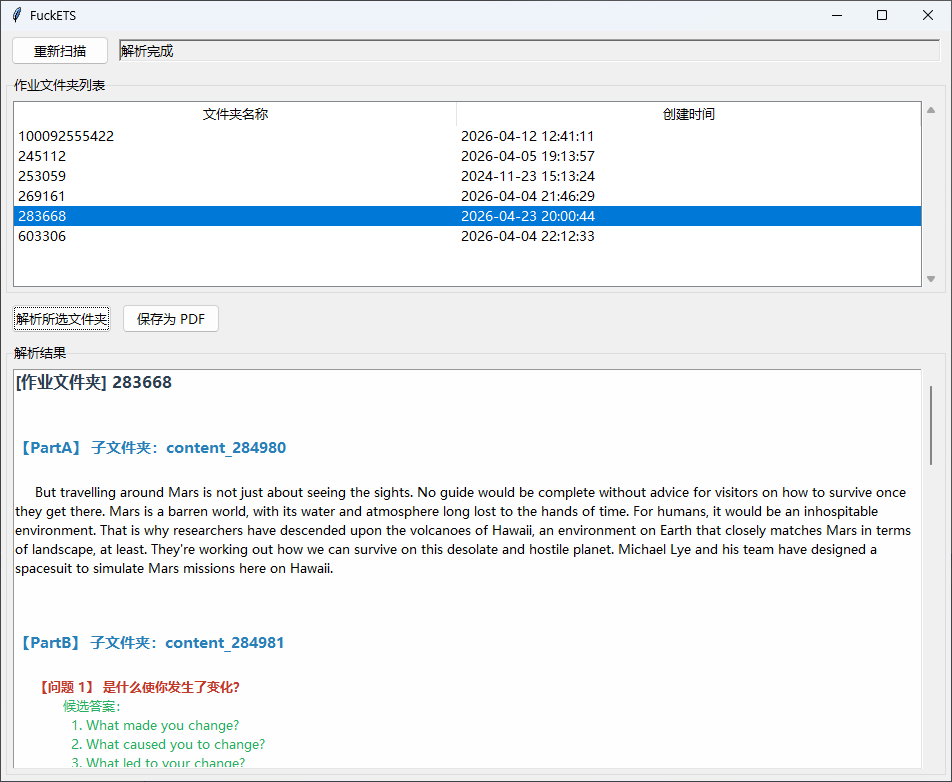

# FuckETS - 去他妈的讯飞E听说

讯飞E听说**高中**版试题答案获取


## 环境要求

- Windows 10 / 11
- Python 3.10 或更高版本

## 安装依赖

```
pip install -r requirements.txt
```

## 使用方法

1. 首先，在电脑版的E听说上下载要解析的试题
2. 然后打开命令提示符,定位到mian.py所在目录，输入以下命令：  
    ```
    python main.py
    ```
    即可运行程序
3. 选择所需的文件夹
    > 一般来说越新的文件夹代表越新的作业
4. 点击“解析所选文件夹”即可输出答案
5. (可选)可点击“保存为PDF”以生成答案的PDF文件，文件字体大小已经过调节，适于分享/手机阅读

- 如果电脑未安装Python，也可下载并使用[Releases](https://github.com/TakaHoshino/FuckETS/releases/latest)中的文件

## 软件截图



## 注意事项

- 本项目目前仅测试了**广东地区**的试题

- 本项目的文件部分使用了**AI生成**

## 项目结构
```
FuckETS
├── main.py            # 程序入口
├── app.py             # GUI 主窗口
├── parser.py          # JSON 解析逻辑
├── pdf_generator.py   # PDF 生成
├── utils.py           # 工具函数
├── requirements.txt   # 依赖列表
└── setup.cmd          # 一键打包脚本
```

## 许可

MIT License