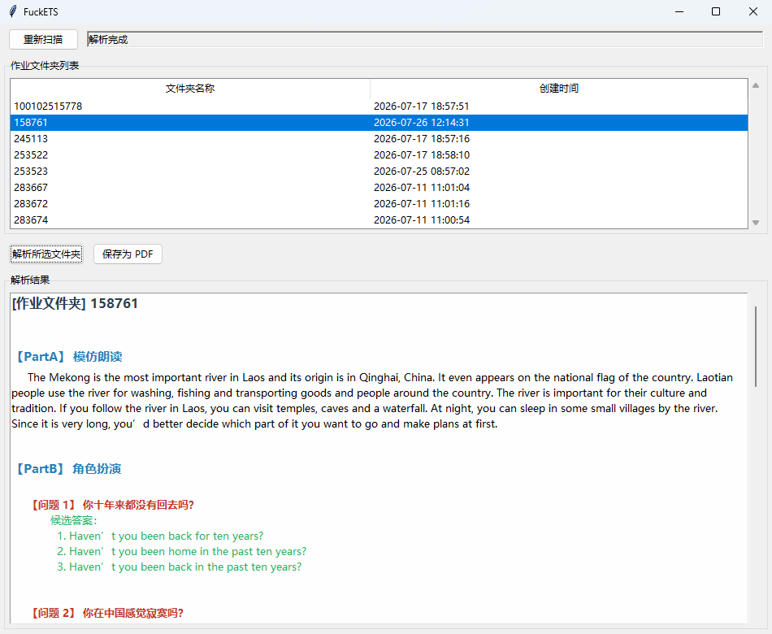

# FuckETS - 去他妈的讯飞E听说

讯飞E听说**高中**版试题答案获取

## 简介

FuckETS 是一个 Windows 桌面工具，用于提取讯飞「E听说」高中版英语试题的参考答案。使用 **C# / .NET 8 + WPF** 开发。

首次启动会进入 **OOBE（出厂初始设置向导）**，完成免责声明同意、选择 E听说 安装目录获取方式等初始设置后，才进入主界面。

## 环境要求

- Windows 10 / 11
- .NET 8 SDK（或更新 LTS）
- `%APPDATA%\ETS\` 目录下存在 E听说下载的试题数据

## 构建与运行

项目已在 `FuckETS.csproj` 中设定 `RuntimeIdentifier=win-x64` 且 `SelfContained=false`（框架依赖、不打包 .NET 运行时），因此构建只保留 Windows x64 所需文件，裁剪掉 QuestPDF 带来的 Linux/macOS 等无关运行时原生库。

```bash
# 还原并构建
dotnet build

# 运行应用
dotnet run
```

构建产物位于 `bin\Debug\net8.0-windows\win-x64\` 或 `bin\Release\net8.0-windows\win-x64\`。

## 发布

Windows x64 框架依赖发布（需目标机器安装 .NET 8 桌面运行时）：

```bash
dotnet publish -c Release -r win-x64
```

如需生成无需安装 .NET 运行时的自包含单文件包（体积更大），可显式覆盖：

```bash
dotnet publish -c Release -r win-x64 --self-contained -p:PublishSingleFile=true
```

## 首次启动（OOBE）

应用启动时会校验注册表 `HKCU\Software\FuckETS` 中的 OOBE 状态；未完成或任一配置项缺失/损坏/非法时，自动进入向导。向导分以下阶段：

1. **免责声明**：阅读并同意（按钮需等待 5 秒倒计时后方可点击），同意前无法进入下一步
2. **选择获取 E听说 安装目录的方式**：自动获取 / 手动输入（可浏览选择，手动路径需有效）
3. **等待并启动 E听说**（仅自动获取时）：检测到 E听说 进程运行后自动推导安装目录
4. **完成**：将 OOBE 完成状态、免责声明同意情况与安装目录写入注册表

中途退出后，再次启动可从已完成阶段继续。注册表任一项缺失、损坏、类型不匹配、或值非法时，会重新进入 OOBE。

## 使用方法

1. 首先，在电脑版的 E听说上下载要解析的试题
2. 启动应用，程序会自动扫描 `%APPDATA%\ETS\` 下所有纯数字命名的作业文件夹（并到 ETS 日志中解析作业标题）
   > 一般来说越新的文件夹代表越新的作业
3. 选择所需的文件夹
4. 点击「解析所选文件夹」即可输出答案（PartA 模仿朗读 / PartB 角色扮演 / PartC 故事复述，按 content.json 结构与特征自动识别 Part 归属）
5. 点击「导出设置…」可自定义 PDF 的正文字号、标题字号、Part 标题字号、页边距、行间距及是否粗体标题，设置会持久化到 `%APPDATA%\FuckETS\settings.json`
6. (可选) 点击「保存为 PDF」以生成答案的 PDF 文件，保存对话框会按作业标题（无则用文件夹编号）自动预填文件名，适于分享/手机阅读

## 日志

应用启动时（含 OOBE 阶段）即开始记录日志，写入 `%APPDATA%\FuckETS\logs\app_yyyyMMdd.log`（按日分文件）。

- 记录应用启动/退出、OOBE 各阶段（免责声明、获取方式、等待 E听说、完成）、作业扫描、试题解析、Part 识别、PDF 导出等关键流程
- 出现异常时记录错误及堆栈，便于定位问题
- 线程安全，写入失败不影响应用运行

## 软件截图



## 注意事项

- 本项目目前仅测试了**广东地区**的试题
- 本项目的文件部分使用了**AI生成**

## 项目结构

```
FuckETS
├── App.xaml            # 应用入口 (WPF)；启动时校验 OOBE 状态并路由主界面/向导
├── App.xaml.cs
├── MainWindow.xaml     # 主界面 (WPF)
├── MainWindow.xaml.cs  # 主界面逻辑（UI 线程 / 后台任务）
├── OobeWindow.xaml     # OOBE 初始设置向导窗口
├── OobeWindow.xaml.cs
├── PdfSettingsWindow.xaml     # PDF 导出设置弹窗
├── PdfSettingsWindow.xaml.cs
├── Pages/              # OOBE 各阶段页面
│   ├── OobePageBase.cs           # OOBE 页面基类
│   ├── OobeDisclaimerPage.xaml.cs   # 阶段1 免责声明（含倒计时）
│   ├── OobeInstallSourcePage.xaml.cs# 阶段2 获取方式（自动/手动）
│   ├── OobeLaunchEtsPage.xaml.cs    # 阶段3 等待并启动 E听说
│   └── OobeCompletePage.xaml.cs     # 阶段4 完成
├── AssemblyInfo.cs
├── FuckETS.csproj      # 项目文件 (.NET 8 + WPF)
├── Models/             # 数据模型
│   ├── ContentData.cs      # content.json 结构映射
│   ├── FolderItem.cs       # 作业文件夹条目
│   ├── PdfExportOptions.cs # PDF 导出参数
│   └── OobeSession.cs      # OOBE 会话共享状态
└── Services/           # 业务服务
    ├── EtsScanner.cs          # 扫描 %APPDATA%\ETS\
    ├── EtsParser.cs           # 解析 PartA/B/C 答案
    ├── PartDetector.cs        # Part 类型识别（structure_type + 特征评分）
    ├── PdfService.cs          # 生成 PDF（QuestPDF，支持导出配置）
    ├── PdfSettingsService.cs  # PDF 设置持久化
    ├── HomeworkTitleService.cs# ETS 日志 → 作业标题
    ├── EtsInstallService.cs   # ETS 进程检测与安装目录推导
    ├── OobeStateService.cs    # OOBE 注册表持久化与校验
    ├── Logger.cs              # 文件日志记录器
    ├── LineClassifier.cs      # 行分类与样式映射
    ├── TextHelper.cs          # HTML 剥离与段落处理
    └── SystemHelper.cs        # 字体查找 / 创建时间
```

## 技术栈

- **语言 / 框架**：C# / .NET 8 / WPF
- **PDF 生成**：QuestPDF（MIT 许可，无 COM 依赖）
- **PDF 设置持久化**：JSON（`%APPDATA%\FuckETS\settings.json`）
- **OOBE 状态持久化**：注册表（`HKCU\Software\FuckETS`）
- **日志**：文件日志（`%APPDATA%\FuckETS\logs\`）
- **异步**：async/await 后台任务，UI 线程不阻塞

## 许可

MIT License