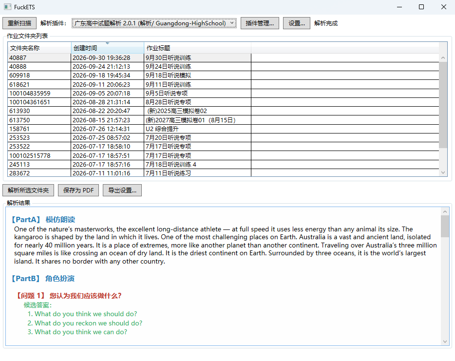

# FuckETS

> 去他妈的讯飞 E 听说 —— 讯飞「E听说」高中版英语试题**参考答案提取工具**


## 这是什么

**FuckETS** 是一个 Windows 桌面小工具，用来把你已经在电脑版「E听说」上下载过的英语试题，快速解析出参考答案。

它不破解、不联网获取题目，而是直接读取 E听说保存在本机 `%APPDATA%\ETS\` 里的试题数据，还原出 **PartA 模仿朗读 / PartB 角色扮演 / PartC 故事复述** 的答案，并支持一键导出成适合手机阅读和分享的 PDF。

**为什么会有这个项目**：E听说 客户端只能在线做题、不能方便地查看答案，手机上复习也不方便。FuckETS 把本机已下载的题目解析出来，给你一份干净、可导出、可存档的答案。

> 本项目目前主要针对**广东地区高中版**试题；其他地区可通过**插件**接入（见下文「插件系统」）。

## 软件截图



## 功能特性

- **自动扫描作业**：一键扫描 `%APPDATA%\ETS\` 下所有作业文件夹，并解析 ETS 客户端日志还原**作业标题**（越新的文件夹代表越新的作业）。
- **自动识别题型**：根据试题数据的 `structure_type` 字段与内容特征，自动判定每个子目录属于 PartA / PartB / PartC。
- **清晰的结果展示**：Part 标题、问题、候选答案分级着色，一眼看清。
- **优雅的 PDF 导出**：基于 QuestPDF 生成 A4 文档，正文用时代罗马体（中文自动回退），标题/问题/答案分类排版；导出前可自定义字号、页边距、行距等（设置持久化）。
- **首次启动向导（OOBE）**：免责声明、自动/手动获取 E听说安装目录，全程引导，未完成配置时无法进入主界面。
- **插件系统**：试题解析与功能扩展均可用插件实现——解析插件适配不同地区，行为插件通过钩子干预扫描、解析、展示、导出流程，甚至向主界面注入按钮。
- **自动检查更新**：启动时检查 GitHub Releases，支持自包含版 / 框架依赖版两种安装包，以及官方 / gh-proxy 两种下载源，一键下载覆盖重启。
- **完整日志**：从启动（含 OOBE）到解析、导出全程记录异常与堆栈，方便排查。

## 使用流程

1. 在电脑版 **E听说** 上下载要解析的试题。
2. 启动 FuckETS，程序自动扫描本地作业文件夹，并尝试从日志还原作业标题。
3. 在列表中选中目标作业（一般越新越靠下）。
4. 在顶部「解析插件」下拉框选择解析器（默认内置**广东高中**解析）。
5. 点击「**解析所选文件夹**」，查看答案。
6. 可选：点击「保存为 PDF」导出答案，文件名会按作业标题（无则用文件夹编号）自动预填。
7. 可选：点击「导出设置…」调整 PDF 样式。

## 插件系统

试题解析已从主程序**完全剥离为插件**，主程序只负责宿主与编排。插件分两类：

| 类型 | 接口 | 作用 |
| --- | --- | --- |
| **解析插件** | `IParserPlugin` | 适配特定地区/实体的题型识别与答案解析 |
| **行为插件** | `IBehaviorPlugin` | 通过钩子干预扫描、解析、展示、PDF 导出等流程，或注入界面按钮 |

- 插件契约位于 **`FuckETS.PluginSdk`**，插件**只依赖 SDK、不引用主程序内部类型**。
- 打包为 `.fep`（zip：`plugin.json` 清单 + 插件程序集），可放入程序目录 `plugins\` 或在「插件管理…」中加载/启停/移除。
- 内置「广东高中」解析插件随程序分发（不可移除，可禁用）。
- 提供 10 个钩子点（`scan.completed`、`part.detect.*`、`part.parse.*`、`parse.completed`、`ui.*`），按优先级链执行，单个插件异常被隔离，不影响主流程。

**开发文档见 [docs/PLUGIN_SDK.md](./docs/PLUGIN_SDK.md)**；示例插件见 `examples/`（行为 ×2、解析 ×1）。

## 获取与运行

**方式一：下载安装包**（推荐普通用户）

前往 [Releases](https://github.com/TakaHoshino/FuckETS/releases) 下载：

- **自包含版**：已内置 .NET 8 运行时，无需安装环境，解压即用，体积较大；
- **框架依赖版**：体积较小，需机器已安装 [.NET 8 桌面运行时](https://dotnet.microsoft.com/download/dotnet/8.0)。

**方式二：从源码构建**（开发者）

需 Windows 10/11 + .NET 8 SDK：

```bash
dotnet build
dotnet run
```

发布：

```bash
# 框架依赖
dotnet publish -c Release -r win-x64

# 自包含单文件
dotnet publish -c Release -r win-x64 --self-contained -p:PublishSingleFile=true
```

> 项目已设 `RuntimeIdentifier=win-x64` 且 `SelfContained=false`，构建只保留 Windows x64 所需文件。

## 注意事项

- 使用前请确保本机 `%APPDATA%\ETS\` 下已存在 E听说 下载的试题数据。
- OOBE 需要指定 E听说 安装目录；可自动从运行中的 E听说 进程推导，也可手动选择。
- 本项目目前**仅测试了广东地区**试题；其他地区欢迎通过插件适配。
- 请仅用于个人学习与研究，遵守当地法律与学校规定（详见软件内免责声明）。
- 本项目的部分文件使用了 **AI 生成**。

## 技术栈

- **语言 / 框架**：C# / .NET 8 / WPF
- **插件系统**：`FuckETS.PluginSdk` 契约类库 + `.fep` 插件包 + 钩子引擎 + 可卸载 `AssemblyLoadContext`
- **PDF 生成**：QuestPDF（MIT，无 COM 依赖）
- **持久化**：OOBE → 注册表 `HKCU\Software\FuckETS`；设置/插件/更新 → `%APPDATA%\FuckETS\*.json`
- **日志**：`%APPDATA%\FuckETS\logs\app_yyyyMMdd.log`
- **异步**：async/await 后台任务，UI 线程不阻塞

## 许可

[MIT License](./LICENSE)
